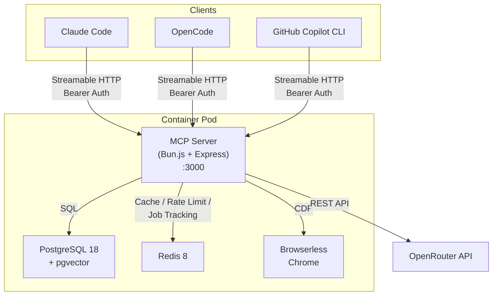
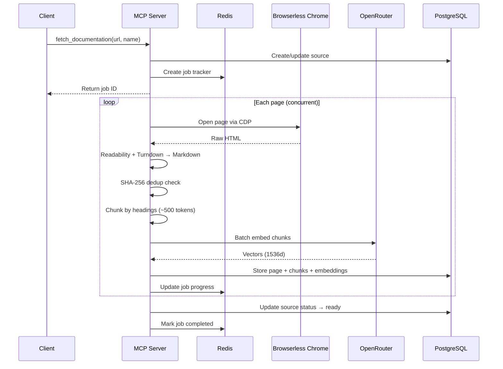
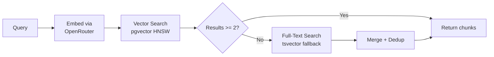

# MCP Documentation Server

A production-ready [Model Context Protocol](https://modelcontextprotocol.io/) server that crawls, processes, and indexes web documentation for semantic search. Connect it to Claude Code, OpenCode, or GitHub Copilot CLI and give your AI assistant instant access to any documentation site.

## Architecture



### Crawl Pipeline



### Search Flow



## MCP Tools

| Tool | Description | Key Parameters |
|---|---|---|
| `fetch_documentation` | Crawl a URL and its sub-pages, convert to markdown, chunk, and embed. Returns a job ID for background tracking. | `url`, `name`, `maxPages?`, `includePatterns?`, `excludePatterns?` |
| `search_documentation` | Semantic vector search with full-text fallback. Returns relevant chunks with source context. | `query`, `sourceId?`, `limit?`, `threshold?` |
| `get_page` | Retrieve the full stored markdown for a specific page. | `url?`, `pageId?` |
| `list_sources` | List all documentation sources with status and crawl progress. | _(none)_ |

## Tech Stack

| Component | Technology |
|---|---|
| Runtime | [Bun.js](https://bun.sh) |
| MCP Transport | Streamable HTTP |
| Database | PostgreSQL 18 + [pgvector](https://github.com/pgvector/pgvector) |
| Cache | Redis 8 |
| Browser | [Browserless](https://browserless.io) Chrome (CDP) |
| Embeddings | [OpenRouter](https://openrouter.ai) `openai/text-embedding-3-small` (1536d) |
| ORM | [Drizzle](https://orm.drizzle.team) |
| HTML Processing | Mozilla Readability + Turndown |
| Auth | API key (Bearer token), SHA-256 hashed, Redis-cached |
| Rate Limiting | Token bucket via Redis Lua script |
| CI/CD | GitHub Actions → GHCR |

## Prerequisites

- [Podman](https://podman.io) or Docker with Compose
- An [OpenRouter](https://openrouter.ai) API key

## Quick Start

### 1. Clone and configure

```bash
git clone https://github.com/mlshdev/fullstack-mcp.git
cd fullstack-mcp
cp .env.example .env
```

Edit `.env` and set your `OPENROUTER_API_KEY`.

### 2. Start the stack

```bash
podman compose up -d
```

This starts 4 services:

| Service | Image | Purpose |
|---|---|---|
| `server` | `ghcr.io/mlshdev/fullstack-mcp:latest` | MCP server on `:3000` |
| `pgvector` | `pgvector/pgvector:pg18-trixie` | PostgreSQL with vector extensions |
| `redis-mcp` | `redis:8.6-rc1-trixie` | Caching, rate limiting, job tracking |
| `browserless` | `browserless/chrome:latest` | Headless Chrome for crawling |

### 3. Create an API key

```bash
podman compose exec server bun run scripts/manage-keys.ts create --name my-key
```

Save the key it outputs - it cannot be retrieved later.

### 4. Verify

```bash
curl http://localhost:3000/health
```

## Connecting to AI Coding Assistants

### Claude Code

```bash
claude mcp add docs-server \
  --transport http \
  --url http://localhost:3000/mcp \
  --header "Authorization: Bearer YOUR_API_KEY"
```

### OpenCode

Add to your `opencode.json`:

```json
{
  "mcp": {
    "docs-server": {
      "type": "http",
      "url": "http://localhost:3000/mcp",
      "headers": {
        "Authorization": "Bearer YOUR_API_KEY"
      }
    }
  }
}
```

### GitHub Copilot CLI (VS Code)

Add to your VS Code `settings.json`:

```json
{
  "github.copilot.chat.mcp.servers": {
    "docs-server": {
      "type": "http",
      "url": "http://localhost:3000/mcp",
      "headers": {
        "Authorization": "Bearer YOUR_API_KEY"
      }
    }
  }
}
```

## API Key Management

```bash
# Create a key
bun run scripts/manage-keys.ts create --name prod-key

# Create with custom rate limit
bun run scripts/manage-keys.ts create --name limited --rate-limit 50 --window 60

# List all keys
bun run scripts/manage-keys.ts list

# Revoke a key
bun run scripts/manage-keys.ts revoke --id <key-uuid>

# Rotate a key (revoke old, create new with same name)
bun run scripts/manage-keys.ts rotate --id <key-uuid>
```

## Environment Variables

| Variable | Default | Description |
|---|---|---|
| `PORT` | `3000` | Server listen port |
| `HOST` | `0.0.0.0` | Server bind address |
| `LOG_LEVEL` | `info` | `debug`, `info`, `warn`, `error` |
| `DATABASE_URL` | - | PostgreSQL connection string |
| `REDIS_URL` | - | Redis connection string |
| `BROWSERLESS_URL` | - | Browserless WebSocket URL |
| `OPENROUTER_API_KEY` | - | OpenRouter API key for embeddings |
| `CRAWL_CONCURRENCY` | `3` | Parallel pages during crawl |
| `CRAWL_MAX_PAGES` | `100` | Max pages per crawl |
| `CRAWL_PAGE_TIMEOUT` | `30000` | Page load timeout in ms |
| `RATE_LIMIT_REQUESTS` | `100` | Requests per window |
| `RATE_LIMIT_WINDOW_SECONDS` | `60` | Rate limit window |

## Project Structure

```
src/
├── index.ts                     # Express app + MCP wiring + graceful shutdown
├── config/env.ts                # Zod-validated environment variables
├── db/
│   ├── schema.ts                # Drizzle table definitions (api_keys, sources, pages, page_chunks)
│   ├── client.ts                # pg Pool + Drizzle instance
│   └── migrate.ts               # Migration runner
├── redis/client.ts              # ioredis singleton
├── auth/
│   ├── middleware.ts             # Bearer token auth with Redis-cached DB lookup
│   └── rate-limiter.ts          # Token bucket via Redis Lua script
├── mcp/
│   ├── server.ts                # McpServer creation + tool registration
│   └── transport.ts             # StreamableHTTP session management
├── tools/
│   ├── fetch-documentation.ts   # Crawl orchestration
│   ├── search-documentation.ts  # Vector + full-text search
│   ├── get-page.ts              # Page retrieval
│   └── list-sources.ts          # Source listing
├── services/
│   ├── crawler.ts               # Puppeteer CDP crawl with concurrency control
│   ├── content-processor.ts     # Readability + Turndown HTML → Markdown
│   ├── chunker.ts               # Heading-based ~500-token chunking
│   ├── embeddings.ts            # OpenRouter batch embedding client
│   └── job-manager.ts           # Redis job tracking (24h TTL)
├── lib/
│   ├── hash.ts                  # SHA-256 helpers
│   ├── logger.ts                # Structured JSON logging
│   └── errors.ts                # Custom error classes
└── health/handler.ts            # /health endpoint
```

## Development

```bash
bun install
bun run dev          # Start with --watch
bun run typecheck    # TypeScript check
bun run db:generate  # Generate Drizzle migrations
bun run db:migrate   # Run migrations
```

## License

MIT
